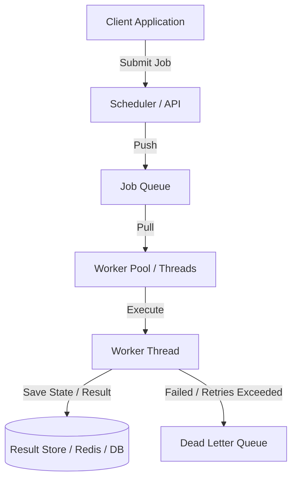

# Concurrent Task Scheduler

A production-style concurrent task scheduling system designed for high throughput, robust error handling, and reliability. This project serves as a foundation for building a distributed task queue system from scratch.

---

## 🏗️ Architecture Design

The system is built on a **Producer-Consumer** architecture using a centralized Scheduler, a Thread-Safe In-Memory Queue, and concurrent Workers pulling jobs and storing execution metadata.



### Component Breakdown

1. **Models (`app/models/job.py`)**: Defines the `Job` domain entity. Tracks unique execution IDs, state transitions (PENDING, RUNNING, COMPLETED, FAILED, RETRYING), error details, payload configuration, and retry budgets.
2. **Queue (`app/queue/job_queue.py`)**: Manages job ingestion. Future versions will implement thread safety, priority queueing, and backpressure configurations.
3. **Workers (`app/workers/worker.py`)**: Active execution loops that run on background threads/processes to execute tasks, handle retries, and log failures.
4. **Storage (`app/storage/result_store.py`)**: Persists outputs and execution records for monitoring and auditability.
5. **Scheduler (`app/scheduler/scheduler.py`)**: Orchestrates the active queue, manages the thread lifecycle of the worker pool, and triggers scheduled/recurring cron tasks.
6. **Utils (`app/utils/logger.py`)**: High-performance logging framework supporting multi-output (console & file) logs, customized trace formats, and thread context metadata.

---

## 🚀 Future Phases & Roadmap

This project is planned to evolve across multiple implementation phases:

### Phase 1: Local Multithreading & Synchronization (Next Step)
- Use standard library `threading` and thread-safe queues (`queue.Queue`).
- Protect shared resources using `threading.Lock` and synchronization primitives.
- Graceful shutdown orchestration (`Event` flags) to avoid terminating active jobs abruptly.

### Phase 2: Retry Mechanics & Dead-Letter Queue (DLQ)
- Linear/Exponential backoff retry algorithms for failed tasks.
- Automatic routing of permanently failing tasks to a separate Dead-Letter Queue (DLQ) for manual inspection and debugging.

### Phase 3: REST API & Monitoring Dashboard
- Incorporate a Flask or FastAPI micro-framework to submit jobs dynamically.
- Develop a frontend dashboard to view live queue sizes, worker health checks, execution times, and job statuses.

### Phase 4: Persistence & Distributed Execution
- Replace the in-memory queue and store with **Redis** and **PostgreSQL/SQLite**.
- Support distributed workers running on separate machines pulling from a shared Redis broker.

---

## 🛠️ Getting Started

### Prerequisites
- Python 3.8 or higher

### Installation
1. Clone the repository and navigate to the project directory:
   ```bash
   cd concurrent-task-scheduler
   ```
2. Set up a virtual environment (optional but recommended):
   ```bash
   python -m venv venv
   source venv/bin/activate  # On Windows: venv\Scripts\activate
   ```
3. Install development dependencies:
   ```bash
   pip install -r requirements.txt
   ```

### Running the Project Verification
Run the verification script to confirm all components are imported and initialized correctly:
```bash
python main.py
```
*(This will log actions to both stdout and a newly created `logs/app.log` file).*
